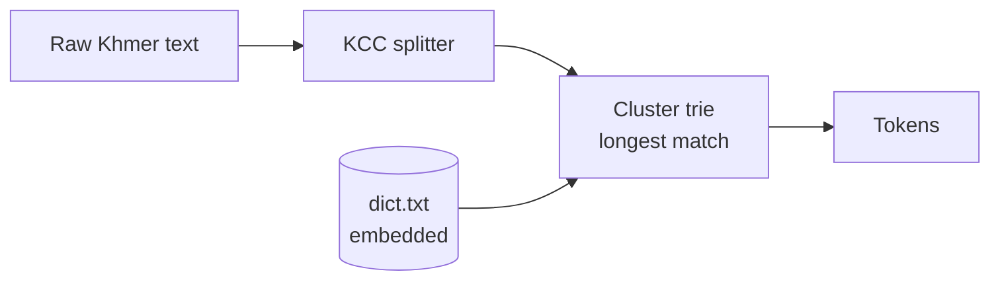
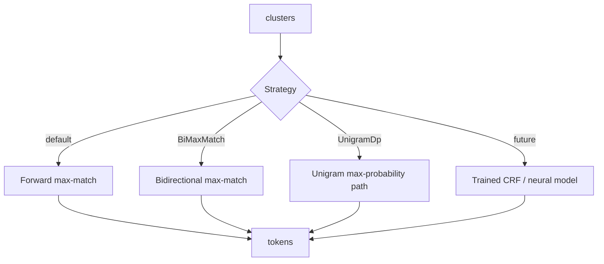
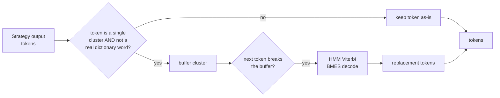
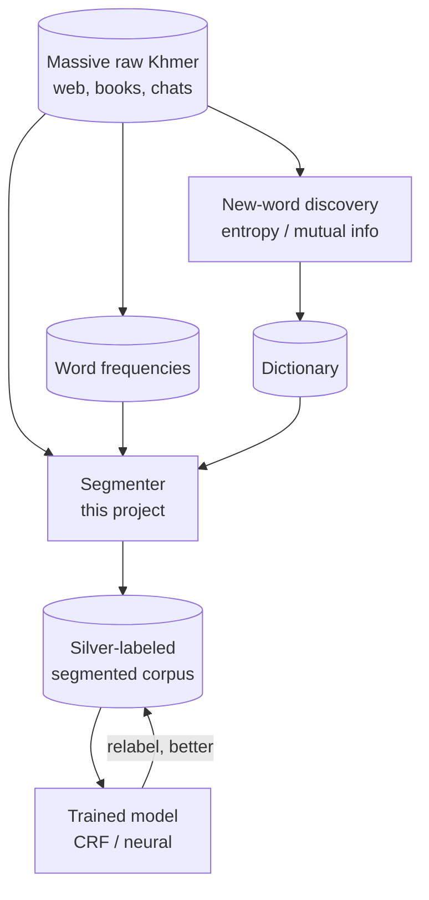
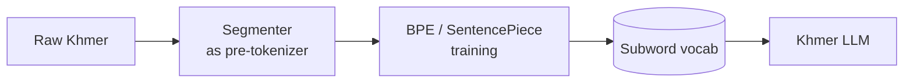

```

```

# Architecture

How `khmer-tokenizer` is put together — the pieces, how data flows through them,
and how today's simple dictionary engine grows into a data-and-training platform
without rewrites. Pair this with [LEARNING.md](./LEARNING.md) (what to learn) and
[ROADMAP.md](./ROADMAP.md) (what to build, in order).

## The one idea to hold onto

Everything is a **pipeline of small, replaceable stages**:

```
raw text → normalize → split into clusters → choose word boundaries → tokens
```

Each stage does one job and hands a clean result to the next. Because the stages
are separate, you can improve or swap any one of them — a better normalizer, a
smarter boundary chooser, a bigger dictionary — without touching the others. That
separation is the whole reason the project can start tiny and still grow into
model training later.

## Components

| Component        | Crate / file               | Job                                          | Status     |
| ---------------- | -------------------------- | -------------------------------------------- | ---------- |
| KCC splitter     | `core/src/kcc.rs`        | group bytes into Khmer Character Clusters    | ✅ built   |
| Trie             | `core/src/trie.rs`       | store the dictionary, find word matches fast | ✅ built   |
| Tokenizer API    | `core/src/lib.rs`        | public entry point, dictionary loading       | ✅ built   |
| CLI              | `cli/src/main.rs`        | run it from the terminal / pipes             | ✅ built   |
| Normalizer       | `core/src/normalize.rs`  | canonicalize Unicode ordering variants       | 🔜 Phase 5 |
| Strategy         | `core/src/strategy.rs`   | pick the boundary algorithm                  | ✅ built (FMM, BiMM, UnigramDp — see below) |
| HMM OOV fallback | `core/src/hmm.rs`      | guess boundaries where the dictionary matched nothing at all | ✅ built (Phase 4 — see below) |
| Eval harness     | `eval/` + `xtask`      | measure P/R/F1 on a gold corpus              | ✅ built   |
| Model (optional) | `model/` (feature-gated) | trained CRF / neural segmenter               | 🔭 future  |
| Bindings         | `wasm/`, `py/`         | run from JS/browser and Python               | 🔭 future  |

## Today's default pipeline (`Strategy::ForwardMaxMatch`)



What happens, in words: the text is split into clusters so a base letter never
gets cut away from its subscripts/vowels; then the segmenter walks a trie built
from the dictionary and, at each position, takes the longest run of clusters that
spells a real word. No match → it emits one cluster and moves on. Deterministic,
no model, microsecond-fast.

## The Strategy seam (built)

The boundary-choosing logic sits behind one interface, so the *how* can
change while the *what* stays stable:



```rust
// The seam: callers never change, the engine behind it can.
pub enum Strategy {
    ForwardMaxMatch,   // default (determinism/speed) — always available
    BiMaxMatch,        // cheap accuracy bump, no extra data needed
    UnigramDp,         // best of the three, but needs KhmerTokenizer::with_frequencies(...) —
                        // no frequency table ships with the crate (see BENCHMARKS.md Phase 3)
    // Model(Box<dyn Segmenter>) // future — a trained model, same API
}
```

A user who writes `tokenizer.segment(text)` doesn't need to change anything
when switching strategies — `KhmerTokenizer::with_strategy(Strategy::BiMaxMatch)`
chains onto any constructor, and the CLI exposes FMM/BiMM the same way via
`--strategy fmm|bimm` (`UnigramDp` isn't CLI-exposed yet — no flag to load an
external frequency file).

`UnigramDp`'s DAG-plus-DP approach is a real algorithmic step up from the
other two, not just a variant: `greedy_match` (used by both FMM and BiMM)
only ever records the *longest* dictionary match at each trie-walk position,
so neither can represent — let alone choose — a competing shorter match that
leads to a better global path. `unigram_dp` records *every* match ending
position as a DAG edge, then a right-to-left dynamic-programming pass over
that DAG picks the path with the highest cumulative log-probability. That
structural difference is why it measurably outperforms BiMM in
`docs/BENCHMARKS.md`, not just a better tie-break rule.

A user who writes `tokenizer.segment(text)` today keeps working when you later
drop in a trained model. That stability is what lets you experiment freely.

## The HMM OOV fallback (built, Phase 4)

Every strategy above shares one blind spot: when a run of clusters matches
*nothing* in the dictionary, they all fall back to one token per cluster —
`Strategy` only ever chooses between different ways of walking the trie, and
a trie has nothing to say about clusters it has no entry for at all. That's
what `R-oov` in `docs/BENCHMARKS.md` measures, and why it stayed flat
(~0.35) across all three Phase 3 strategies.

`KhmerTokenizer::with_hmm(...)` is an orthogonal knob, not a fourth
`Strategy` variant, because it operates on the *output* of whichever
strategy ran, not on the trie walk itself:



Concretely (`trie.rs`'s `apply_hmm_fallback` + `is_dict_word`): scan the
strategy's token output; any *maximal run* of single-cluster tokens that
aren't themselves dictionary entries gets buffered and handed to
`HmmModel::segment_oov`, which Viterbi-decodes the most likely BMES
(Begin/Middle/End/Single) tag sequence and converts it to token boundaries.
Every other token — including genuine single-cluster dictionary words —
passes through untouched. That untouched-ness is why it composed cleanly
with both `ForwardMaxMatch` and `UnigramDp` with **zero measured R-iv
cost** (see `docs/BENCHMARKS.md` Phase 4): it structurally cannot affect a
token the trie walk already matched.

Same posture as `UnigramDp`'s frequencies: no trained `HmmModel` ships with
the crate (see `ATTRIBUTION.md`) — callers build one with
`HmmModel::from_counts(...)` from a segmented corpus they're licensed to
use.

## The data flywheel (how massive data plugs in)

A dictionary engine looks static, but it's actually the *starter motor* for a
self-improving loop. Two flows feed it, and one flow comes out of it:



- **Frequencies in:** counting words over a huge corpus gives the numbers the
  `UnigramDp` scorer needs — more data, better disambiguation.
- **New words in:** statistics over cluster sequences surface words the
  dictionary is missing, so the corpus *grows the dictionary by itself*.
- **Labels out → models in:** the segmenter labels raw text cheaply (silver
  data); you train a CRF/neural model on that; the better model relabels; repeat.
  This is **weak supervision / self-training**, and the dictionary engine is the
  cold start that makes it possible for a low-resource language.

## Feeding a Khmer LLM (pre-tokenization)

LLMs don't train on words; they train on **subword pieces** (BPE/SentencePiece).
On a language with no spaces, BPE makes ugly, meaningless merges. If you segment
into words *first* and feed those boundaries in, the learned subword vocabulary
respects real Khmer structure:



So the same engine that helps a startup tokenize product reviews today can be the
front-end that makes a future Khmer foundation model's tokenizer clean.

## What keeps it "open" (design rules)

1. **Stages are independent.** Normalize, split, score are separate modules with
   plain inputs/outputs. Improve one, disturb none.
2. **One public API, swappable engines.** The `Strategy` seam means dictionary
   and learned models coexist behind `segment()`.
3. **Offsets and labels are first-class (planned).** `segment()` will be able to
   return byte offsets and **BMES tags** (Begin/Middle/End/Single) — the exact
   format CRF/neural training expects. That turns the tool from a CLI into a
   *label generator*.
4. **Zero required dependencies.** The core stays `std`-only and tiny, so it runs
   anywhere in a data pipeline — parallel batch jobs, edge, browser (WASM).
5. **Permissive license, permissive data.** MIT/Apache code + CC-BY/MIT-class
   bundled data keeps every downstream use (including commercial LLM training)
   legal.

## Future crate layout

```text
khmerTokenizer/
├── core/      # kcc, normalize, trie, strategy, score  (std-only)
├── cli/       # terminal tool (+ --strategy, --tags)
├── eval/      # P/R/F1 harness over a gold corpus
├── xtask/     # download corpora, prepare dict, run eval
├── model/     # OPTIONAL trained CRF/ONNX segmenter (feature-gated)
├── wasm/      # wasm-bindgen → npm/browser
├── py/        # PyO3 → pip, for data pipelines
├── data/      # downloaded corpora (gitignored, NC-licensed)
└── docs/      # RESEARCH, ROADMAP, ARCHITECTURE, LEARNING, BENCHMARKS
```

Nothing here forces you to build it all. The point is that each box can be added
later **without reshaping** what already exists — which is the definition of an
architecture that's open to the future.