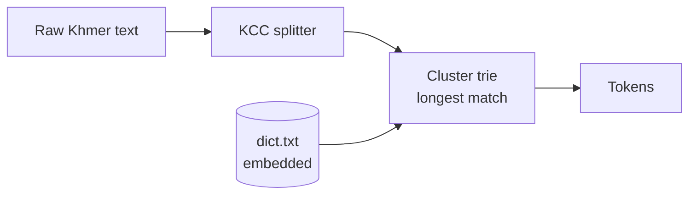
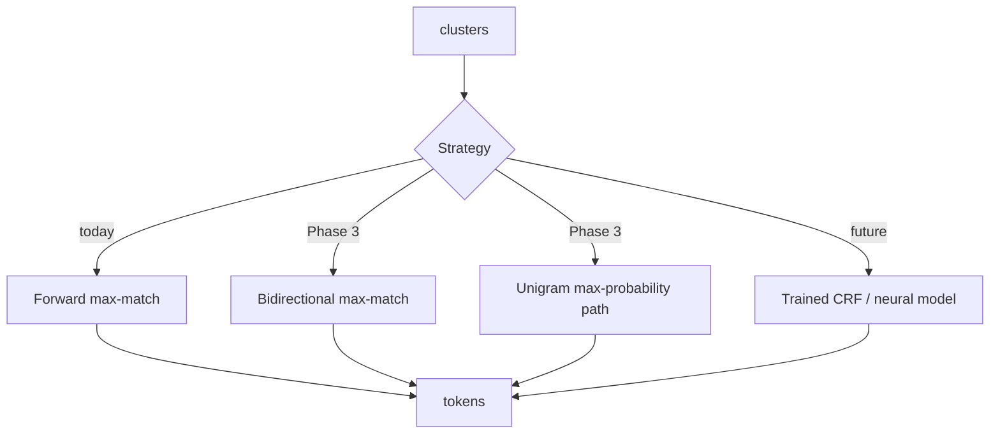
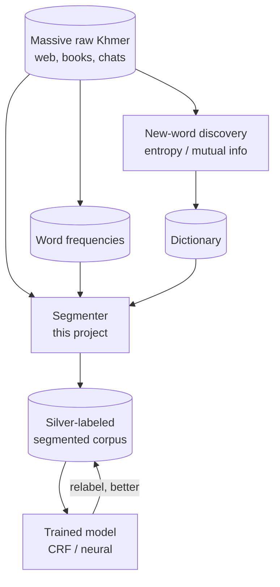
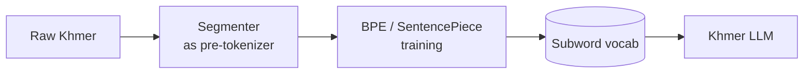

```

```

# Architecture

How `khmer-tokenizer` is put together — the pieces, how data flows through them,
and how today's simple dictionary engine grows into a data-and-training platform
without rewrites. Pair this with [LEARNING.md](./LEARNING.md) (what to learn) and
[ROADMAP.md](./ROADMAP.md) (what to build, in order).

## The one idea to hold onto

Everything is a **pipeline of small, replaceable stages**:

```
raw text → normalize → split into clusters → choose word boundaries → tokens
```

Each stage does one job and hands a clean result to the next. Because the stages
are separate, you can improve or swap any one of them — a better normalizer, a
smarter boundary chooser, a bigger dictionary — without touching the others. That
separation is the whole reason the project can start tiny and still grow into
model training later.

## Components

| Component        | Crate / file               | Job                                          | Status     |
| ---------------- | -------------------------- | -------------------------------------------- | ---------- |
| KCC splitter     | `core/src/kcc.rs`        | group bytes into Khmer Character Clusters    | ✅ built   |
| Trie             | `core/src/trie.rs`       | store the dictionary, find word matches fast | ✅ built   |
| Tokenizer API    | `core/src/lib.rs`        | public entry point, dictionary loading       | ✅ built   |
| CLI              | `cli/src/main.rs`        | run it from the terminal / pipes             | ✅ built   |
| Normalizer       | `core/src/normalize.rs`  | canonicalize Unicode ordering variants       | 🔜 Phase 5 |
| Strategy         | `core/src/strategy.rs`   | pick the boundary algorithm                  | 🔜 Phase 3 |
| Scorer           | `core/src/score.rs`      | frequency-based max-probability path         | 🔜 Phase 3 |
| Eval harness     | `eval/` + `xtask`      | measure P/R/F1 on a gold corpus              | 🔜 Phase 1 |
| Model (optional) | `model/` (feature-gated) | trained CRF / neural segmenter               | 🔭 future  |
| Bindings         | `wasm/`, `py/`         | run from JS/browser and Python               | 🔭 future  |

## Today's segmentation pipeline



What happens, in words: the text is split into clusters so a base letter never
gets cut away from its subscripts/vowels; then the segmenter walks a trie built
from the dictionary and, at each position, takes the longest run of clusters that
spells a real word. No match → it emits one cluster and moves on. Deterministic,
no model, microsecond-fast.

## Where it's going: the Strategy seam

The single most important design decision for the future is to put the
boundary-choosing logic behind one interface, so the *how* can change while the
*what* stays stable:



```rust
// The seam: callers never change, the engine behind it can.
pub enum Strategy {
    ForwardMaxMatch,   // today
    BiMaxMatch,        // Phase 3 — cheap accuracy bump
    UnigramDp,         // Phase 3 — frequency-scored, recommended default
    // Model(Box<dyn Segmenter>) // future — a trained model, same API
}
```

A user who writes `tokenizer.segment(text)` today keeps working when you later
drop in a trained model. That stability is what lets you experiment freely.

## The data flywheel (how massive data plugs in)

A dictionary engine looks static, but it's actually the *starter motor* for a
self-improving loop. Two flows feed it, and one flow comes out of it:



- **Frequencies in:** counting words over a huge corpus gives the numbers the
  `UnigramDp` scorer needs — more data, better disambiguation.
- **New words in:** statistics over cluster sequences surface words the
  dictionary is missing, so the corpus *grows the dictionary by itself*.
- **Labels out → models in:** the segmenter labels raw text cheaply (silver
  data); you train a CRF/neural model on that; the better model relabels; repeat.
  This is **weak supervision / self-training**, and the dictionary engine is the
  cold start that makes it possible for a low-resource language.

## Feeding a Khmer LLM (pre-tokenization)

LLMs don't train on words; they train on **subword pieces** (BPE/SentencePiece).
On a language with no spaces, BPE makes ugly, meaningless merges. If you segment
into words *first* and feed those boundaries in, the learned subword vocabulary
respects real Khmer structure:



So the same engine that helps a startup tokenize product reviews today can be the
front-end that makes a future Khmer foundation model's tokenizer clean.

## What keeps it "open" (design rules)

1. **Stages are independent.** Normalize, split, score are separate modules with
   plain inputs/outputs. Improve one, disturb none.
2. **One public API, swappable engines.** The `Strategy` seam means dictionary
   and learned models coexist behind `segment()`.
3. **Offsets and labels are first-class (planned).** `segment()` will be able to
   return byte offsets and **BMES tags** (Begin/Middle/End/Single) — the exact
   format CRF/neural training expects. That turns the tool from a CLI into a
   *label generator*.
4. **Zero required dependencies.** The core stays `std`-only and tiny, so it runs
   anywhere in a data pipeline — parallel batch jobs, edge, browser (WASM).
5. **Permissive license, permissive data.** MIT/Apache code + CC-BY/MIT-class
   bundled data keeps every downstream use (including commercial LLM training)
   legal.

## Future crate layout

```text
khmerTokenizer/
├── core/      # kcc, normalize, trie, strategy, score  (std-only)
├── cli/       # terminal tool (+ --strategy, --tags)
├── eval/      # P/R/F1 harness over a gold corpus
├── xtask/     # download corpora, prepare dict, run eval
├── model/     # OPTIONAL trained CRF/ONNX segmenter (feature-gated)
├── wasm/      # wasm-bindgen → npm/browser
├── py/        # PyO3 → pip, for data pipelines
├── data/      # downloaded corpora (gitignored, NC-licensed)
└── docs/      # RESEARCH, ROADMAP, ARCHITECTURE, LEARNING, BENCHMARKS
```

Nothing here forces you to build it all. The point is that each box can be added
later **without reshaping** what already exists — which is the definition of an
architecture that's open to the future.